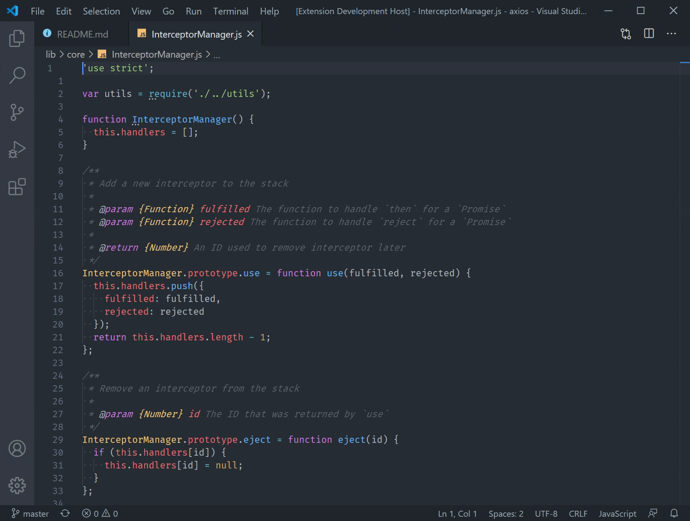

_Developed in 24 hours for Microsoft's VSCode hackathon_

# BabelFish

Less than 20% of the world speak English.

Yet, the current landscape of programming and software development is largely centered around the English language. More than just programming constructs like "for" or "else", the bigger issue lies with the large body of documentation for many software libraries that are written solely in English. Only few large companies have the resources to translate their documentation into different languages, and this leaves thousands of other libraries (many built by individuals and small groups) inaccessible to non-English speakers.

BabelFish (inspired by the magical fish from the Hitchhiker's Guide to the Galaxy) aims to tackle this problem, making software development more inclusive and accessible for everyone.

## Features

BabelFish is a VSCode extension that analyzes source files for documentation comments, detects the language they are written in, and automatically translates them if they do not match the user's native language. The translated text is then displayed using VSCode's CodeLens API. Currently, only JavaScript source files are supported.

A demo with the language set to Mandarin

## Configuration

Set your preferred language for translation inside the extension settings. You will also need to configure an API key for Azure's Translator service for this extension to be functional.

## Potential future updates

- Fix minor issues with the parsing and translation (e.g. the extension shouldn't translate parameters in the JSDoc)
- Expand to support additional programming languages
- Investigate how to improve the UX for displaying translated strings - with the current implementation, the screen can get cluttered when there are too many translations
